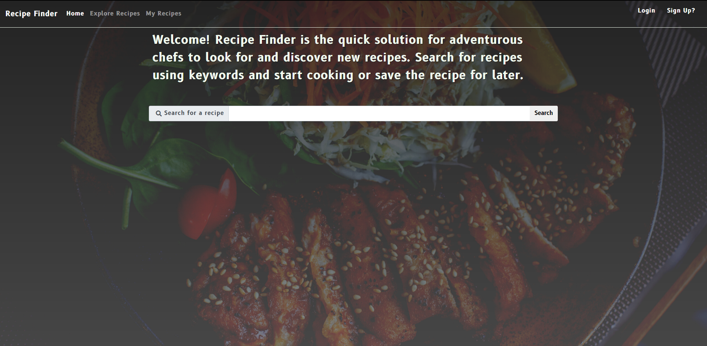
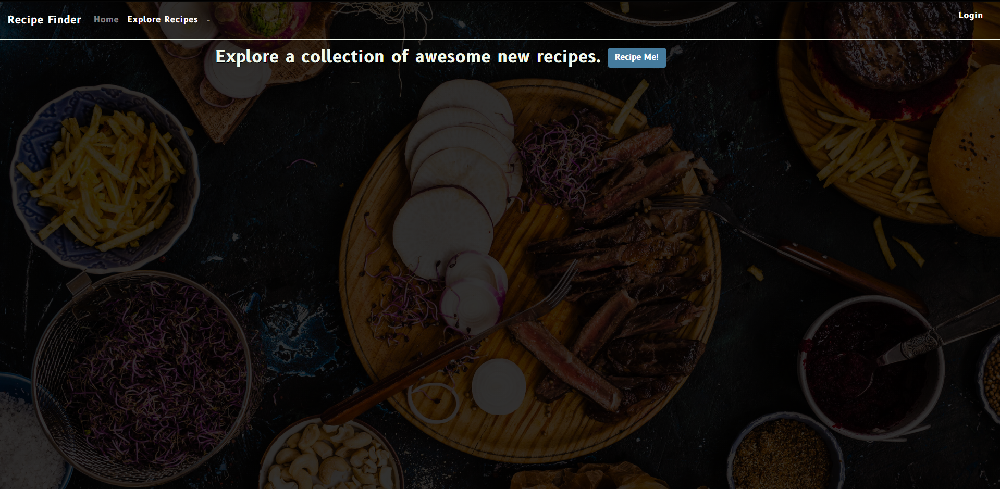
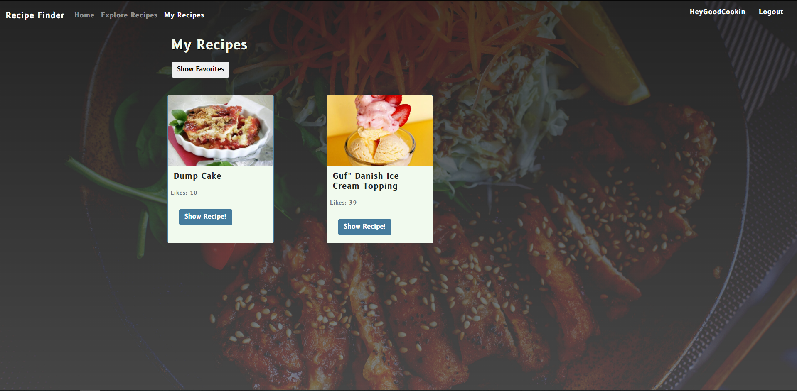

# Recipe Finder

 ### Recipe Finder uses spoonacular api to explore and search for recipes. You can save the recipes you like and come back to them later on. 

---

## Screenshots

---

## Technologies Used
1. HTML
2. CSS
3. Javascript
4. JQuery
5. AJAX
6. Bootstrap 4 (Front-End Framework)
7. PHP (No Framework)
8. MySQL (In conjuction with PHP it uses PDO)
9. GitHub
10. Heroku

---

## Getting Started
The project was developed in XAMPP, the development environment needs PDO module to run the SQL statements. Screenshots of the database schema can be found above to help replicate a local environment.

[Deploy-Project](https://brandons-recipe-finder.herokuapp.com/)  

---

## Future Enhancements
1. Convert to either PHP framework like Laravel or technology stack like MERN.
2. Move away from relational database. 
3. Hide API keys and setup env files. 
